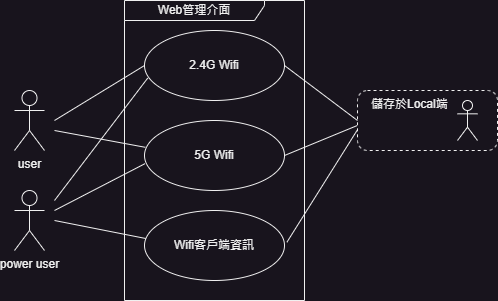

# UML和物件導向的設計基礎 (UML-and-Object-Oriented-Design)

## 瀑布模型 (WaterFall)
1. 它要求在開始任何編碼之前有一個詳細的計畫(計畫驅動的方法論)
2. 限制需求在開發期間預計不會發生任何變動
3. 是一種線性模式，定義了開發步驟或階段，每個開發階段都需要完成前一個階段。


### 瀑布模型的各個階段 (Phases of the Waterfall Model)  
#### 階段1 : 收集並分析需求: Collect & analyze requirements  
在本階段中預期的應用程式功能必須與涉眾釐清，所有細節都必須徹底記錄下來。

#### 階段2 : 架構定義: Architecture definition  
在本階段中設計應盡可能清晰和詳細，團隊應該要能根據此計畫實現產品開發
1. 什麼元件/第三方套件構成我們的系統 Components/packages
2. 每種成分的基本類型是什麼 Key types
3. 這些類型如何相互互動以實現所需的功能 Interactions
4. 我們的軟體安全嗎 Security
5. 表現怎麼樣 Performance
6. 如何響應錯誤、系統容錯率 Fault-tolerance
7. 如何處理邊緣案件、系統穩定性 Robustness
8. 將來是否需擴展系統、系統可擴展性 Extensibility
9. 預計使用那些第三方套件 3rd party usage
    
> 如果操作正確，瀑布模型將產生預期的結果

#### 階段3 : 執行、實施: Implementation  
在本階段中軟體開發階段通常被劃分為更小的單元，然後每個單元都由開發人員實現和測試，

#### 階段4 :  確認: Verification  
在本階段中基於預定義的標準評估軟體，必須檢查產品是否提供了我們期望的功能，並執行測試以確保軟體按預期工作，這個過程一直持續到所有Bug被修復，當測試階段完成並且交付了給定的版本時，就進入了維護階段。

#### 階段5 :  維護: Maintenance  
根據定義，維護階段是關於修復較小的錯誤，通常也包含功能增強，客戶可能會提供新的要求，並且涉及實質性的變化。
1. 功能性 Functional
2. 效能 Performance
3. 安全性 Security
4. 可用性 Usability

### 優勢
1. 明確開發計畫與時程表
2. 詳細需求蒐集、向利害關係人每週進度報告
3. 詳細規劃、嚴格限時、注重設計、角色職責分工明確

### 思辨: 
設計思維面向上若將所有修補擠壓在一個補丁上可能造成「複雜度增加、風險提高、難以回朔、協同開發困難」。

1. 相反，採用分散的修復策略，即將每個修復或改變都包裝成獨立的補丁，可能會降低這些風險。這使得每個修改都可以單獨測試、理解和應用，同時也更容易進行版本控制和協同開發。
2. 或者，重新設計一個新的瀑布模是，並且在明確所有需求後預先制定詳細的計畫，如果能達到所有要求都被預先精確定義，並且不會隨時間推移而改變，那麼瀑布模是將是一個完美的選擇。

### 劣勢:
由於其線性模式，在開發過程後期階段不能考慮新的需求，因此有一些小改進
1. 修復缺陷 Fix defects
2. 通過一些靈活的實踐和方法 小小的增強瀑布模式 Small enhancements

### 瀑布中的解決方案
1. 靈活性和適應性: 預留時間或預算以應對預期之外的變更
2. 強調溝通: 保持開放和良好的溝通，以及確保和利害關係人之間的溝通渠道暢通
3. 風險管理: 評估可能的需求變更和其他不確定性，制定應對計畫，以便在需要時能夠迅速作出反應

### 最適合實施瀑布的情境
- 生命控制系統 (Life-control Systems)  
- 醫療系統 Medical (Systems)  
- 軍事系統 Military (Systems)  

### 結論:  
若需求能夠被明確定義且於系統開發中後期不會遇到頻繁需求上的變更，則採取瀑布模式是一種好的選擇。  
反之若預期將遭遇頻繁變更，則應考慮使用更適合變化的開發方法，如敏捷開發。


## 敏捷模型 (Agile)
對於期望需求可以快速頻繁變化的專案非常有效，敏捷是一種相對較新的軟體專案管理方法。

敏捷宣言定義了四種價值觀
1. Individuals and interactions over processes and tools (個人和互動優於過程和工具)
2. Working software over comprehensive documentation (工作軟體優於總合文件)
3. Customer collaboration over contract negotiation (客戶協作優於合約談判)
4. Responding to change over following a plan (響應變化優於遵循計劃)

敏捷中的一個主要核心原則為，在每個迭代(Sprint)結束時，會交付一個具體的、可運行的、有價值的軟體功能或特性。這個功能是在迭代期間設定的目標之一，通過開發、測試和整合來實現。  
其強調的是將價值快速、可持續地交付給用戶，以確保產品在整個開發過程中保持高度的可用性和客戶滿意度。  
> Sprint 通常持續 2 到 4 週。

### 優點
- 在每個Sprint結束時，團隊將交付比前一個Sprint更加正確的產品
- 可以經常檢查正在開發的產品
- 利害關係人有機會在早期評估並提供回饋，而不是等待最終交付
- 頻繁的檢查點可以確保，專案朝著正確的方向發展
- 與瀑布不同，敏捷並沒有將測試與開發分開，而是緊密結合

敏捷中的另一個主要核心為: 讓客戶參與到開發過程中，使得專案團隊與涉眾及使用者之間有著密切的關係。  
這個模型在需求不能預先定義的情況下運作得最好，敏捷非常適合依賴許多不確定因素的軟體專案，並且可以預期變化。  
這種協作模式的一大好處是，它通常會帶來更高的客戶滿意度，團隊成員可能會透過直接與客戶接觸而更有動力。  
敏捷不是方法論，而是透過其宣言價值觀與原則定義的一種思維方式。

### 實施敏捷的例子
1. Scrum
2. Kanban

### 結論
使用敏捷方法的時機，需求模糊或快速變化、客戶無法精確描述最終產品應該做什麼或看起來像什麼的情況下使用。

## 物件導向的核心概念 (Core Object-Orientation Concepts)

### 1950年代 非結構化程式設計 (Non-structured programming)
最初電腦程式是巨大的，連續的程式碼區塊，程式依順序排列的語句組成，因為產生難以閱讀、理解、維護的義大利麵程式碼，而遭受相對嚴厲批評。

### 1960年代 結構化程式設計  (Structured programming)
是一種程式設計方法，強調使用模組化的結構，將程式分解成可管理的小部分。  
它注重模組的獨立性和功能的明確定義，以提高代碼的可讀性和維護性。透過結構化程式設計，程式設計師能夠使用順序、選擇(if)、迭代(迴圈)和模塊化等基本控制結構，編寫更清晰、可理解的代碼。。

1. 函數（Function）： 函數是一個獨立的、可重複使用的程式碼區塊，接受輸入並返回輸出。函數是模塊化程式設計的基本元素，有助於將程式劃分為小的、可管理的部分。
2. 方法（Method）： 在物件導向程式設計中，方法是與對象相關聯的函數。類別中的方法定義了對該類別進行操作的行為。
3. 類別（Class）： 類別是物件導向程式設計的基本概念，它封裝了數據和操作這些數據的方法。類別有助於將程式結構化成更可管理的部分，同時促進代碼的重用性。
4. 模組（Module）： 模組是一個獨立的程式碼文件或一組相關的程式碼，通常包含一個或多個函數、類別或其他程式碼結構。模組化設計有助於將程式分解為小的、相互獨立的部分。
5. 套件（Package）： 在某些程式語言中，套件是將相關的模組組織在一起的一種方式。套件有助於更好地管理和組織程式碼。
> 這些術語一起強調了將程式設計劃分為小而可管理的部分，以提高程式的可讀性、可維護性和重用性。

#### 面臨的一些挑戰
程式變得非常大且複雜時，僅依賴結構化程式設計顯然無法解決增加的複雜度。  
隨著程式的複雜性增加，管理變得更加困難。

#### 特徵
- 邏輯步驟 (logical steps)
- 依賴子程序 (relies on subroutines)
- 提高程式碼可讀性 (improves code readability)
- 減少開發時間 (reduces development time)

#### 結論
1. 適用於中小型開發項目，個人認為是一些小型Package包。  
2. 依賴於動作(Action)，將程序分解成小的、可管理的模組，這些模組按照結構化的方式組織，並使用順序、選擇和迭代等基本控制結構來實現邏輯。
3. 程式被組織成一個主程序和多個子程序（或函數），每個子程序執行特定的動作。這些動作可以包括讀取輸入、進行計算、執行條件判斷、執行循環等。程序的流程通過控制結構來定義，這些結構可以清晰地表示程序的邏輯結構，使得代碼易於理解和維護。

### 1980年代 物件導向程式設計 (Object-Oriented programming, OOP)

主要思想為將程式分割成獨立的物件，每個物件都代表系統的一部分，映射到不同實體。  
每個物件皆對自己的資料進行操作，並具有特定的角色，以形成系統的物件相互作用。

面相對象一詞與物件導向實際上是指同一種程式設計原則，只在表達上有所差異，
- 面相對象: 強調的是以"對象"為中心的軟體開發方式。它包括了對象的概念、封裝、繼承、多態等基本特性，以及相應的設計原則。
- 物件導向: 強調的是將對象的概念應用到實際的編程實踐中。當我們談論物件導向編程時，我們通常指的是使用物件、類別、繼承和多型(態)等概念來組織和設計程式碼的方式。

> **這邊OOP一定要徹底深入理解並實作，不然跟紙上談兵沒啥區別。**

### 理解物件 (Objects)
路上有位年長的爺爺和奶奶幸福的走在一起。

**物件對象(受詞是句子中的名詞)**: 爺爺奶奶  
不變的**屬性(形容詞)**:老年(年紀)、男/女(性別)  
可變的**屬性(形容詞)**:幸福/快樂/開懷(氛圍)、路上/公園椅子上/用餐(場景)  
**動作(行為)**:走在一起/坐在一起/擁抱在一起  

### 理解類別 (Class)
創建物件導向程式設計前，我們需要先辨識潛在的物件，與它們的屬性和職責。  

step1. 首先需要一個類別(Class)  
step2. 想好一個主題概念 如虛擬世界中的怪物(Monster)  
step3. 在這個主題下的類別都有的屬性(Property):外觀、種族、習性、特長，及方法(Method) (行為方法): 生存打獵、領地防衛  

哥布林: 屬性: 矮小、綠精靈、群居、靈敏，方法: 爪擊()、撕咬()、巡邏()  
飛龍: 屬性: 巨大、龍類、領地、大胃王，方法: 吐息()、撕裂重擊()、甩尾()、猛撞()、踐踏()、修築工事()、氣息覺察()

### 理解抽象 (Abstraction)
在物件導向程式設計中"抽象"一詞，通常是用來概括同一主題概念之間，所擁有的共同屬性或方法。  
簡單來說無倫是抽象類別或是介面，僅提供方法/屬性的聲明，並且不提供任何實現，而這些方法/屬性具體的實現，則需由繼承抽象的子類別具體化主題概念定義。

- 透過抽象，我們可以將物件的複雜性隱藏在簡單的介面背後
- 將同一主題概念底下的共同特性提取出來
- 定義專案運行時所需的共同屬性/行為，而忽略一些用不到的其他屬性，使我們專注於重要的事務上，而不需要全面的去定義。
- 比如在玩家面對虛擬世界中的"怪物"時，困難程度在新手模式下，玩家可能只需在乎通關與怪物的外觀是否好看，而非專注研究屬性(外觀、種族、習性、特長)，或使用的方法等。

### 理解封裝和資料隱藏 (Encapsulation and Data Hiding)

每個怪物都有其私有的屬性（外觀、種族、習性、特長）和方法（生存打獵、領地防衛），同時派生類別(Derived Class)也有自己特有的方法。透過封裝，我們隱藏了內部實現細節，並提供了公共介面供外部程式碼使用。

- 介面僅暴露必要的公共方法供外部程式碼呼叫使用，才能訪問私有屬性
- 透過修飾符設置私有(private)來隱藏內部細節，可以保護物件免受外部程式碼干擾
- 資料隱藏旨在保持物件之間的依賴關係最小化、保護物件免受不必要的外部依賴
- 防止系統依賴於可能被修改的屬性或方法

一個緊密耦合系統 : 大部分物件都相互依賴，這是一個錯誤設計，因為一旦改了A節點，將導致BCD無法運作。  
一個非緊密耦合系統 : 在虛擬世界的怪物這個主題概念上，怪物僅能使用各自的屬性/方法/特有方法和玩家進行互動，而不會因為任意 Monster 物件的調整，而影響到全局系統運作。

在主題概念中怪物會是一種基底類別(Base Class)，而哥布林(Goblin)與飛龍(Dragon)則為派生類別(Derived Class)，通過繼承並實現它所定義的屬性/方法，並擁有各自特有的方法，其中有些屬性與方法可能是私有的(private)，而在主程式中宣告哥布林、飛龍物件時，只能透過它們的公開(public)方法對其私有屬性進行訪問，。

- 比方說公開了怪物的棲息地屬性，則任何更改都可能導致系統的其他部分被影響，反之若限制對這些隱藏屬性的訪問，則不必擔心變化帶來的連鎖反應。
- 只需公開使用上所需的屬性或方法

### 理解繼承(Inheritance)

如果沒有繼承比方說建築設計類別、會計類別，可能都需要計算Sum()、Avg()，就會需要在每一個類別上都撰寫加總以及平均值方法。  
如果沒有特地要覆寫方法，則可避免類似的程式碼一直產生。

- 重用性 : 物件導向是關於關注點的粒度和分離，因此應善用繼承以避免編寫大量重複且類似的程式碼
- 通常與多態(型)搭配使用

### 理解多態/型(Polymorphism)

多型又區分為**編譯時期多型(靜態)**與**執行時期多型(動態)**

靜態多型:
- 在編譯時期，編譯器（compiler）就已經確定了實際呼叫要執行的實際實現方法。
- 主要涉及編譯時期的型別檢查和方法解析
- 編譯器檢查變數的聲明和賦值、函數和方法的引數和返回值的型別、顯式和隱式的型別轉換。

動態多型:  
- 在執行時期，由系統程式決定實際要執行的方法或操作
- 主要涉及到在執行期間的方法解析與物件的實際型別
- 物件的實際型別在運行時期才確定
- 這種解析發生在方法呼叫的瞬間，系統必須根據物件的實際型別來找到對應的方法實現 


``` C#
// 基礎類別
public class Monster
{
    // 私有屬性
    private string name;
    private string appearance;
    private string race;
    private string habitat;
    private string behavior;

    // Constructor
    public Monster(string nm, string app, string rac, string hab, string beh)
    {
        name = nm;
        appearance = app;
        race = rac;
        habitat = hab;
        behavior = beh;
    }

    // 方法
    public void SurviveAndHunt() // 戰鬥時使用的技能搭配方法
    {
        Console.WriteLine($"{race} is surviving and hunting.");
    }

    public void TerritoryDefense() // 各種血量下切換的戰鬥階段 (影響技能搭配方法)
    {
        Console.WriteLine($"{race} is defending its territory.");
    }

    public void MakeSound()
    {
        Console.WriteLine($"{name} make a sound.");
    }

    // Getter 方法
    public string GetName()
    {
        return this.name;
    }

    ...
}

// 衍生類別: 哥布林
public class Goblin : Monster
{
    // 私有資料成員
    private string Habitat;

    // 建構子 (Constructor)
    public Goblin(string hab) : base("哥布林", "矮小", "綠精靈", "群居", "靈敏") 
    {
        Habitat = hab;
    }

    public override void MakeSound()
    {
        Console.WriteLine("Goblin evil laugh!");
    }
    ...
}

// 衍生類別: 飛龍
public class Dragon : Monster
{
    // 私有資料成員
    private string Habitat;

    // 建構子 (Constructor)
    public Dragon(string hab) : base("飛龍", "巨大", "龍類", "領地", "大胃王") 
    {
        Habitat = hab;
    }

    public override void MakeSound()
    {
        Console.WriteLine("Dragon intimidate!");
    }
    ...
}

// 外部程式
public class Program
{
    // 靜態多型 : 由編譯時期就已經決定好實際執行的物件型別
    static void Main1()
    {
        Monster myMonster = new Dragon();
        myMonster.MakeSound();
        // output: "Dragon intimidate!"
    }

    // 動態多型 : 由執行時期決定實際執行的物件型別
    static void Main2(int playerLevel = 10)
    {
        Monster myMonster = LicenseToAdventure(playerLevel);
        myMonster.MakeSound();
        // output: "Goblin evil laugh!"
    }

    private Monster LicenseToAdventure(int level)
    {
        switch (level)
        {
            case level < 15:
                return new Goblin("森林");
            else
                return new Dragon("山谷");
        }
    }
}
```

### 複習
在物件導向程式設計中，為防止系統依賴於可能被修改的屬性或方法，是透過封裝和抽象的概念實現。

1. 封裝 (Encapsulation)
   - 具備私有屬性、公開屬性、公開方法
   - 防止系統直接依賴於內部實現細節，僅能透過公開的方法/屬性進行訪問
2. 抽象（Abstraction）
   - 將物件的複雜度隱藏於簡單的介面背後
   - `IMonster`定義基礎屬性/方法，而具體實現則在`Goblin`、`Dragon`類別中
   - 系統則依賴於`IMonster`介面，而不需要直接依賴於實現該介面的物件類別
3. 依賴反轉原則 （Dependency Inversion Principle, DIP）
   - 其主張高層模組不應依賴於底層模組，甚至兩者皆應依賴於抽象。
     - 高層模組: 應用程式的主要商業邏輯處理與流程
     - 底層模組: 資料訪問層、檔案操作、信件往來、其他最小單元的結構化方法
   - 這反轉了傳統的依賴方向，強調了對抽象的依賴，而非具體實現
   - 即高層/底層模組之間溝通，同樣都過定義好的抽象介面進行相依互動。


### 補充說明

以更全面地理解物件導向的概念

繼承（Inheritance）：繼承是物件導向程式設計中的一個重要概念，它允許你建立一個新的類別，以重複使用現有類別的屬性和方法。你可以考慮在Monster例子中引入繼承，例如創建一個基本的Monster類別，然後衍生出更具體的子類別，如FireMonster、WaterMonster等，以表示不同屬性的Monster。

封裝（Encapsulation）：封裝是隱藏物件的內部實現細節，僅暴露必要的接口。這可以通過使用私有（private）和公共（public）成員實現。在你的例子中，你可以強調如何使用封裝確保屬性只能透過特定的方法訪問，從而維護程式碼的安全性和可靠性。

多型（Polymorphism）：多型允許同一個方法可以在不同的類別中有不同的實現。這可以通過介紹一個抽象的Monster類別，其中包含一個攻擊方法，然後每個具體的Monster子類別可以以自己獨特的方式實現攻擊。

建構函數（Constructor）與解構函數（Destructor）：你可以提及建構函數和解構函數的概念。建構函數在創建物件時執行初始化操作，而解構函數則在物件被銷毀時執行清理操作。

介紹實際程式碼片段：如果可能的話，可以添加一些實際的程式碼片段，以展示如何在某種程式語言中實現你的Monster類別，以及如何創建和使用Monster的實例。


網路例子: 
``` C#
using System;

// 基礎圖形類別
class Shape
{
    public virtual void Draw()
    {
        Console.WriteLine("繪製基礎圖形");
    }
}

// 衍生的圓形類別
class Circle : Shape
{
    public override void Draw()
    {
        Console.WriteLine("繪製圓形");
    }
}

// 衍生的矩形類別
class Rectangle : Shape
{
    public override void Draw()
    {
        Console.WriteLine("繪製矩形");
    }
}

class Program
{
    static void Main()
    {
        Shape[] shapes = new Shape[]
        {
            new Circle(),
            new Rectangle(),
            new Shape() // 基礎圖形
        };

        foreach (var shape in shapes)
        {
            shape.Draw();
        }
    }
}

```
在 Main 方法中，我們創建了一個 Shape 類別的陣列，其中包含不同類型的圖形對象。通過迭代這個陣列，我們可以動態呼叫每個圖形物件的 Draw 方法，並根據實際的物件類型執行相應的繪製操作。

這種設計使得系統更容易擴展，當需要新增其他圖形類型時，只需創建一個新的衍生類別，而不必修改現有的程式碼。這展現了物件導向程式設計中的多態性和擴展性的優勢，有助於應對變動性的需求。

### 分析與設計 (Analysis and Design)
建構物件導向程式設計的預備步驟，無論開發方法如何，步驟皆是類似的。
1. 收集需求 (collect requirements) : 涉及大量腦力激盪與討論，一旦達成協議，就需要將想法記錄下來。要求盡可能明確。只寫下強調系統要做什麼的決定。模糊的想法會導致後續的衝突。在這個階段我們要回答以下問題
   1. 確認將要解決的問題是什麼
   2. 闡明解決問題所需的功能 (應用程式或框架需要做什麼實現該功能)
   3. 紀錄重要的決定      
2. 描述系統 (describe the software) : 從使用者角度來描述應用程式(Use Case)，重點在於獲得盡可能多的清晰度，只要有助於向客戶傳達你的想法，那就去做。這些原型被證明是非常有用的，特別是如果客戶不熟悉平台或他們沒有特定的期望。透過準確傳達我們的願景，可以避免意外和誤導性的期望。
   1. 使用使用者故事(user stories)來引發討論，而不是描述細節。
   2. 避免使用專業術語
   3. 描述應用程式的步驟；可能包含建立視覺模型、線框圖、非功能性原型圖等...
   4. 讓使用者更加明確清晰預計實踐出來的應用程式畫面為何
3. 識別類別 (identify the classes) : 確定系統中應該存在哪些類別 
   1. 識別現實中的主題概念 : 具體的物件(人、車、書)，或其相應的抽象(生命、交通、知識)
   2. 確定影響系統的關鍵元素 : 目的是深入理解使用者需求和系統約束，以便有針對性地進行後續的設計和實現工作。
      1. 識別用戶（Users）：理解系統的最終使用者，識別不同類型的用戶及其需求。這有助於確保系統能夠滿足不同用戶的期望和使用情境。
      2. 捕捉業務規則（Business Rules）：識別並記錄與系統相關的業務規則，這些規則可能影響系統的行為和流程。確保系統能夠符合業務需求。
      3. 定義使用案例（Use Cases）：描述系統的不同使用情境，包括用戶和系統之間的互動。使用案例有助於理解系統功能，並確定需要哪些類別和方法。
      4. 分析現有資訊系統：如果是改進或擴充現有系統，則需要分析現有的資訊系統結構、資料流動、程式邏輯等，以確定需要調整或擴展的部分。
      5. 識別關鍵數據（Key Data）：確定系統中的關鍵數據或資料，這些數據將在系統中流動，並影響不同類別的狀態。
      6. 考慮系統的擴展性和未來需求：考慮未來可能的擴展需求，以確保系統設計具有一定的擴展性和靈活性。
   3. 定義物件的屬性和行為 : 為每個識別的類別定義相關的屬性和方法。屬性表示類別的狀態，而方法表示類別的行為。這有助於確定每個類別的職責和功能。
   4. 建立類別之間的關係：識別類別之間的相互關係，包括繼承、聚合、關聯等。這有助於建立系統的整體結構。
   5. 確定類別的範圍：確定每個類別的範圍，即它負責處理的特定任務和數據。這有助於確保每個類別都有清晰的職責，並有利於系統的模組化。
4. 創建圖 (Create Diagrams) : 利用可視化圖形闡述物件導向的系統 (Unified Modeling Language, UML)，它是一種標準的方式
   1. 闡述物件之間的屬性和行為(方法)的可視化表示(Class Diagram)、
   2. 闡述物件之間的交互作用進行建模(Sequence Diagram)

> 這些步驟的目標是建立起系統的基本框架，為後續的詳細設計和實現提供基礎。通過識別類別，開發人員能夠更好地理解系統的要求，確保系統以物件導向的方式建模，並且有助於構建更具靈活性和擴展性的程式設計。

#### 其他備註:
1. 建立視覺模型 : 指的是以圖形或圖像的形式來呈現的模型，目的是為了更容易理解、傳達或分享複雜的概念、系統或流程。如 : 結構圖、流程圖、時間軸圖、數據流圖、網路圖、架構圖。  
2. 線框圖（Wireframes）: 這是一種視覺化設計工具，用於展示應用程式介面的佈局、結構和基本元素，強調用戶界面的外觀和互動。  
3. 非功能性原型圖 : 指的是系統的非功能性需求的視覺化表示。如 : 性能圖、安全性圖、可用性圖、擴展性圖、可靠性與容錯性圖、效能分析圖

### 換個例子
在台北租屋搬進新家，在整理房間這件事上將會是一天比一天更好，直到需求被滿足則停止，並在後續進入維運階段(如:定期打掃、清潔、添購新傢俱(需求))。


## 為何我們需要一種通用的描述用語言
在上述物件導向的前兩步驟，不需要任何特殊工具或設計語言，僅需要文字編輯器或紙筆即可。  
但在下一個階段詳細定義我們系統的類別時，由於沒有一套統一的描述語言，導致開發者有各種非標準方法的氾濫。  
僅透過原始碼(Source Code)非常沒有效率，而且有時需要耗費大量時間才能看明白在做什麼，以及在與他人討論軟體設計與商業邏輯時就會產生各種不確定性，因此我們才需要使用一套通用的描述語言。

## 統一塑模語言 (Unified Modeling Language, UML)

ref:
1. UML: https://hackmd.io/@lchuang8211/BJx7n82KL#%E8%B3%87%E6%96%99%E6%B5%81%E7%A8%8B%E5%9C%96Data-Flow-Diagram-DFD  
2. C4圖: https://www.youtube.com/watch?v=rr9OUCC6h2M
3. 什麼是物件導向與UML: https://weilihmen.medium.com/%E7%89%A9%E4%BB%B6%E5%B0%8E%E5%90%91-%E8%BB%9F%E9%AB%94%E7%94%A2%E5%93%81%E7%B6%93%E7%90%86%E7%9A%84%E5%85%A5%E9%96%80%E8%AA%B2-b3d8b3fa1be4
4. 14 種 UML 圖的綜合指南: https://www.cybermedian.com/tw/a-comprehensive-guide-to-14-types-of-uml-diagram/
5. MBA智庫百科: https://wiki.mbalib.com/zh-tw/UML
6. 簡單理解 UML 類別圖: https://misomiso43.medium.com/%E7%B0%A1%E5%96%AE%E7%90%86%E8%A7%A3-uml-%E9%A1%9E%E5%88%A5%E5%9C%96-f0b32a3272c

### 使用UML的好處:
1. 透過思考Class、Object、interaction可使我們對將要實現的需求有更深入的理解
2. 透過設計可使我們能更有效的與其他開發人員進行溝通，並可使用UML圖作為開發或改進的起點
3. 簡單的圖表清晰的說明系統能做到什麼
4. 客戶可快速查看是否缺少了什麼

> 詳細的需求還是需要靠PM、SD給出的規格書才能詳盡描述功能

#### Use Case Diagram (用例圖)
目的是可視化系統的功能需求。  
可針對單一功能進行描繪，或包含其他子功能的用例圖。
繪畫方法:
畫橢圓並將標題放在其中，接下來開始畫火柴人，在通用情況下將其放置在橢圓的左側空白區域，作為與系統產生互動的主要參與者或其他系統，右側則為次要參與者

以設定中華電信數據機為例，新的光纖ADSL數據機+Wifi分享器，首先由工程師or外包廠商來到你家進行設備更換or安裝，接下來會在事先約定好的方式寄送一組帳密給用戶，以簡訊為例通常只會給予一般使用者帳密，而非管理員的進階帳密，在用例圖中我們有好幾個橢圓，對應著路由器(Route)可設定基本、進階功能，但一般使用者僅能針對其中的Wifi基本設定進行開、關、SSIS(網路名稱)進行編輯，但如果是Admin使用者則可以多使用防火牆、限制連接速率等橢圓功能...  




免費工具:
1. StartUML
2. Draw.io: 
   1. 線上: https://app.diagrams.net/
   2. 桌面板: https://github.com/jgraph/drawio-desktop/releases/tag/v22.1.2

分三大類、14種圖：  
1. 結構圖形：類別圖、物件圖、元件圖、剖析圖、佈署圖、複合結構圖、套件圖。  
2. 行為圖形：使用者案例圖、活動圖、狀態機企圖。  
3. 互動圖形：時序圖、溝通圖、計時圖、互動觀點圖。  

四種常見的需求分析與系統分析相關的圖：類別圖、使用案例圖、活動圖、時序圖

## 其他一些筆記
1. 學習UML的動機是什麼
   1. 僅掌握編寫程式的能力是不夠的
   2. 必須知道如何應用常見的物件導向原則，來設計軟體系統，並且必須能夠描述我們的設計，以便其他人可以清楚理解它
   3. UML(統一建模語言) 提供了一組標準的可視化符號和圖表技術
2. 物件導向的基本概念
   1. 軟體分析與設計過程的各個步驟 (掌握帶來的效益:將能更有效的設計軟體系統)
3. 資料流程圖
   1. 用例圖 (Use-case Diagram)  
      - 用途: 以一種正式的方式描述需求
   2. 類別圖 (Class Diagram)
      - 用途: 可以對構成系統的主要類型以及它們之間的關係進行建模
   3. 時序圖 (Sequence Diagram)
      - 用途: 描述物件在時間序列中的交互作用。
   4. 狀態圖表
4. 


## Memo
瀑布式原則、敏捷式原則；絕對會需要它們來快速同步和組織我們的開發相關活動，包含「編碼、設計、產品管理、預算、測試、文檔、發佈(Realese)和維護」。  
使用瀑布方法開發的系統通常需要詳細的UML藍圖，而敏捷則不太需要。  
